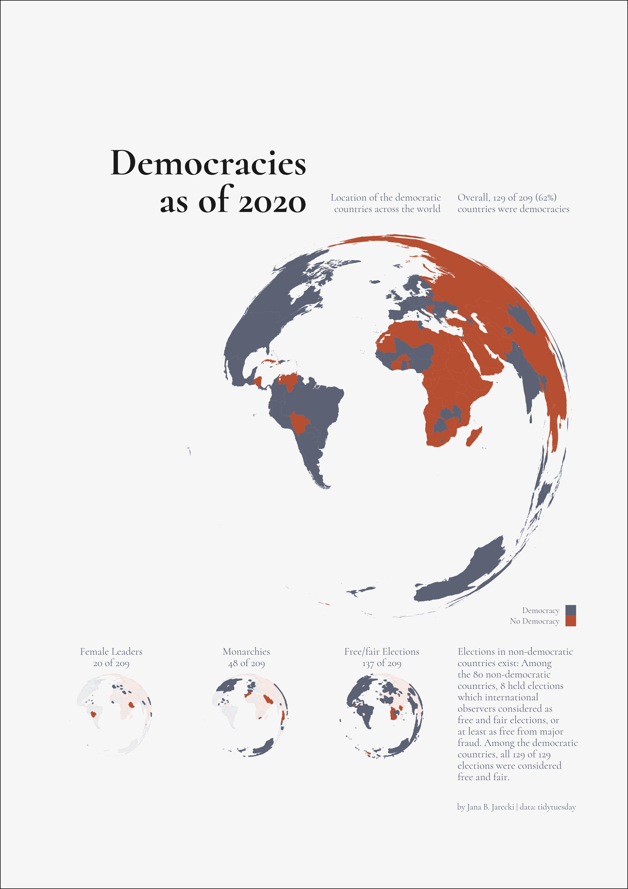

# Data Visualization and Quantitative Information Design

Since 2012, I've been fascinated by the power of clear and effective visuals, whether untangling complex ML model outputs or illustrating simple data stories.

You'll find my visualizations are **code-first**, which means they're agile and ready to update as the data evolves. I bring my **cognitive** science domain **knowledge** to this - understanding what makes a graph work for people based on evidence on how we read visuals (like research by [Garcia-Retamero et al, 2017](https://oxfordre.com/communication/display/10.1093/acrefore/9780190228613.001.0001/acrefore-9780190228613-e-302)) and making sure they're accessible (color-blind friendly, [Birch, 2012](https://pubmed.ncbi.nlm.nih.gov/22472762/)).

My approach leans on strong quantitative data **design fundamentals**: the grammar of graphics ([Wilkinson, 2005](https://link.springer.com/book/10.1007/0-387-28695-0)) and is informed by elegant graphic-design principles, like informative grid layouts.

Why all this effort? Because I believe that well-crafted visuals are a (the?) key to understanding complexity.

|    |    |    |
| -- | -- | -- |
|  |   |  |
| Features of Democracies in 2020   [View Code](code/democracies-as-of-2020.R) | Major Depression Symptoms by Scale   [No Code] | Features of Democracies in 2020   [View Code](code/democracies-as-of-2020.R) |
