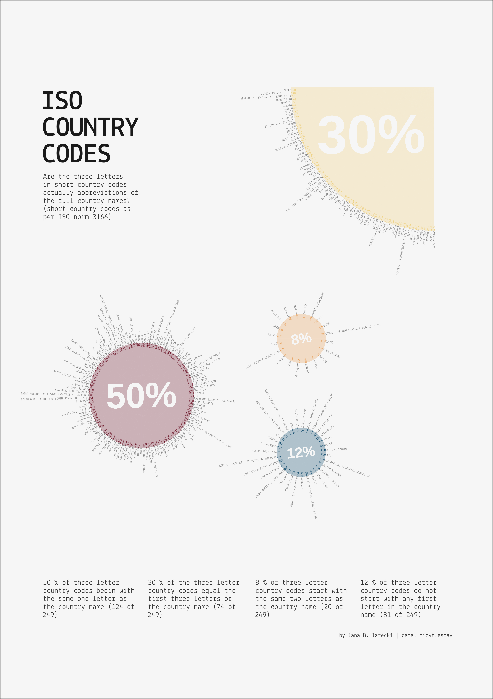

# Advanced Visualizations of Complex Data

Since 2012, I've been fascinated by the power of clear, effective visuals, whether untangling **complex ML model outputs** or illustrating **simple data stories**.

### Principles in my Work

Code-first, Psychological Knowledge, Vision Science, Graph Accessibility, Grammar of Graphics, Graphic Design
 

*
Read more about these principles
*

You'll find my visualizations are **code-first**, which means they're agile and ready to update as the data evolves. I bring my **cognitive** science domain **knowledge** to this - understanding what makes a graph work for people based on evidence on how we read visuals (like research by [Garcia-Retamero et al, 2017](https://oxfordre.com/communication/display/10.1093/acrefore/9780190228613.001.0001/acrefore-9780190228613-e-302)) and making sure they're accessible (color-blind friendly, [Birch, 2012](https://pubmed.ncbi.nlm.nih.gov/22472762/)).

My approach leans on strong quantitative data **design fundamentals**: the grammar of graphics ([Wilkinson, 2005](https://link.springer.com/book/10.1007/0-387-28695-0)) and is informed by elegant graphic-design principles, like informative grid layouts.

Why all this effort? Because well-crafted visuals are key to understanding complexity.

### Examples of my Data Visualizations

| Sparse Bayesian Model of Covid-19 Digital Health | Vaccination Decision Features in 26'700 People |  Properties of World Democracies in 2020 |
| :---: | :---: | :---: |
|  |  |    |
| [view code](code/covid-19-digital-health.R) | [view code](code/peoples-vaccination-decisions.R) | [view code](code/democracies-as-of-2020.R) | 

| Major Depression Symptoms on 52 Clinical Scales | ISO Country Codes |
| :---: | :---: |
|  |  |
| [Fried (2016) publication](https://pubmed.ncbi.nlm.nih.gov/27792962/) | [view code](code/iso-country-codes.R) |
